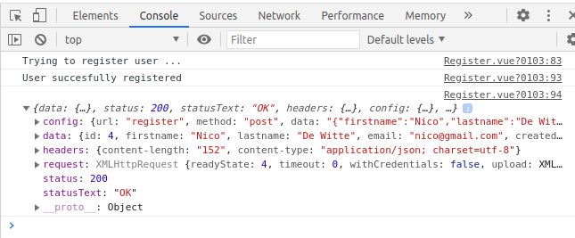
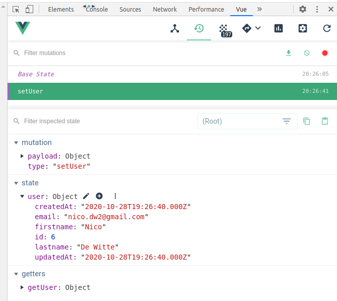
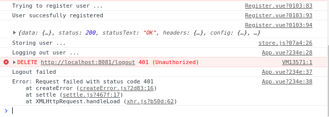
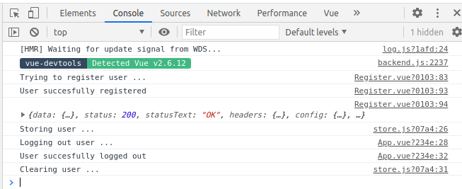

# Demo of Frontend Authentication

Using VueJS (2), Vuetify, Axios, Vuex and Vue-router.

Usable backend for demonstrational purposes: [My Devices](https://github.com/BioBoost/my-devices-backend).

## Setting Up Vue Project

Create a new Vue App

```bash
vue create authentication-demo
```

Select features manually and make sure to select the `Router`. We'll add `Vuex` later. Leave defaults for the rest.

Next add `vuetify` using (keep defaults):

```bash
vue add vuetify
```

Start the app:

```bash
yarn serve
```

## Create Navigation and Main Layout

Add some navigation buttons to the App layout in `App.vue`:

```vue
<template>
  <v-app id="authdemo">
    <v-app-bar
      app color="red"
    >
      <v-spacer></v-spacer>
      <v-toolbar-items>
        <v-btn color="white" text>Register</v-btn>
        <v-btn color="white" text>Login</v-btn>
        <v-btn color="white" text>Logout</v-btn>
      </v-toolbar-items>
    </v-app-bar>

    <v-main id="main">
      <v-container class="fill-height">
        <router-view></router-view>
      </v-container>
    </v-main>
  </v-app>
</template>

<script>
export default {
  name: "App",
};
</script>
```

## Create Register View

Create `Register.vue` view which takes in a `firstname`, `lastname`, `email` and `password` of the user. Also add a `Register` button which can later trigger the `register` method we'll add.

```vue
<template>
  <v-row align="center" justify="center">
    <v-col cols="12" md="8">

      <v-form v-model="valid">
        <v-row align="center" justify="center">
          <v-col cols="12">
            <v-text-field
              v-model="firstname" label="First name" :rules="nameRules" required
            ></v-text-field>
          </v-col>
        </v-row>
              
        <v-row align="center" justify="center">
          <v-col cols="12">
            <v-text-field
              v-model="lastname" label="Last name" :rules="nameRules" required
            ></v-text-field>
          </v-col>
        </v-row>
              
        <v-row align="center" justify="center">
          <v-col cols="12">
            <v-text-field
              v-model="email" label="Email" :rules="emailRules" required
            ></v-text-field>
          </v-col>
        </v-row>
              
        <v-row align="center" justify="center">
          <v-col cols="12">
            <v-text-field
              v-model="password" label="Password" :rules="passwordRules" type="password" required
            ></v-text-field>
          </v-col>
        </v-row>
              
        <v-row align="center" justify="center">
          <v-col cols="12">
            <v-btn block color="primary" >Register</v-btn>
          </v-col>
        </v-row>
      </v-form>
    </v-col>
  </v-row>
  
</template>

<script>
export default {
  name: 'Register',
  components: {
  },
  data: function() {
    return {
      valid: false,

      firstname: '',
      lastname: '',
      email: '',
      password: '',

      nameRules: [
        v => !!v || 'Name is required',
        v => v.length <= 10 || 'Name must be less than 10 characters',
      ],
      emailRules: [
        v => !!v || 'E-mail is required',
        v => /.+@.+/.test(v) || 'E-mail must be valid',
      ],
      passwordRules: [
        v => !!v || 'Password is required',
        v => v.length >= 12 || 'Password must be more than 12 characters',
      ],
    }
  },
}
</script>
```

## Navigating to the Register view

Add a route to the `router` to the `Register` view:

```js
import Register from '@/views/Register.vue'

//....

{
  path: '/register',
  name: 'Register',
  component: Register
},
```

Now you can link to the route from the `Register` button in `App.vue`:

```html
<v-btn color="white" to="/register" text>Register</v-btn>
```

## Create Login View

Next create the `Login` view which is basically a shrunk down version of the `Register` view.

```vue
<template>
  <v-row align="center" justify="center">
    <v-col cols="12" md="8">

      <v-form v-model="valid">
        <v-row align="center" justify="center">
          <v-col cols="12">
            <v-text-field
              v-model="email" label="Email" :rules="emailRules" required
            ></v-text-field>
          </v-col>
        </v-row>
              
        <v-row align="center" justify="center">
          <v-col cols="12">
            <v-text-field
              v-model="password" label="Password" :rules="passwordRules" type="password" required
            ></v-text-field>
          </v-col>
        </v-row>
              
        <v-row align="center" justify="center">
          <v-col cols="12">
            <v-btn block color="primary">Login</v-btn>
          </v-col>
        </v-row>
      </v-form>
    </v-col>
  </v-row>
  
</template>

<script>
export default {
  name: 'Login',
  components: {
  },
  data: function() {
    return {
      valid: false,

      email: '',
      password: '',

      emailRules: [
        v => !!v || 'E-mail is required',
        v => /.+@.+/.test(v) || 'E-mail must be valid',
      ],
      passwordRules: [
        v => !!v || 'Password is required',
        v => v.length >= 12 || 'Password must be more than 12 characters',
      ],
    }
  },
}
</script>
```

Also allow the user to navigate to the `Login` view by adding the correct route:

```js
import Login from '@/views/Login.vue'

// ...

{
  path: '/login',
  name: 'Login',
  component: Login
},
```

and configuring the login button in `App.vue`:

```html
<v-btn color="white" to="/login" text>Login</v-btn>
```

## Setting up the Authentication Service

Next we'll setup the `AuthenticationService` which will provide us with the axios calls required for authentication.

Before we do this, we will have to add `axios` as a dependency to our project:

```bash
yarn add axios
```

Next setup an axios instance in the file `services/Api.js`:

```js
import axios from "axios";

export default () => {
  let api = axios.create({
    baseURL: `http://localhost:8081`
  });
  return api
};
```

In a real application the backend url should be made available using environment variables.

Next create the `services/AuthenticationService.js` file which will provide the authentication service to the backend api:

```js
import Api from "@/services/Api";

export default {
  register(accountInfo) {
    return Api().post("register", accountInfo);
  },
  login(credentials) {
    return Api().post("login", credentials);
  },
  logout() {
    return Api().delete("logout");
  },
};
```

## Registering a User

Time to allow a user to register him/herself.

Start by adding an event handler to the `register` button in the `Register` view. Add a `console.log` or something.

```html
<v-btn block color="primary" @click="register">Register</v-btn>
```

```js
methods: {
  register() {
    console.log("Trying to register user ...");
  }
}
```

If this works, its time to call the real logic. For this we'll need to import the `AuthenticationService`. We'll also be hashing the password before sending it to the backend, so we will also need the `crypto` package.

```js
import AuthenticationService from "@/services/AuthenticationService";
import Crypto from "crypto";
```

Call the `register` method of the `AuthenticationService` inside a `try-catch` and make sure to pass the user credentials:

```js
methods: {
  async register() {
    console.log("Trying to register user ...");

    try {
      const response = await AuthenticationService.register({
        firstname: this.firstname,
        lastname: this.lastname,
        email: this.email,
        password: Crypto.createHash("sha256").update(this.password).digest("hex"),
      });

      console.log("User succesfully registered");
      console.log(response);
    } catch (error) {
      console.log("Register failed");
      console.log(error);
    }
  }
}
```

Note that the `register` function needs to be made `async` because the `axios` call is async and we're awaiting it.

This should result in a working registration setup:



## Storing the User

Now that the register process is up and running we'll need a way to store our `user` object throughout the application. We could emit the user and save it in the app and pass it down each component that needs it but thats not such a good idea. It's also not very clean.

The user will be required in many places, for showing information, checking credentials, ...

A much cleaner solution is the `vuex` store which allows our app to keep global state. It serves as a centralized data store for our whole application.

More information can be found here: [Vuex](https://vuex.vuejs.org/).

### Installing Vuex

Let's start by installing the `vuex` package.

```bash
yarn add vuex
```

### Setup the store

Next we'll need to setup the store and pass it to `Vue` so it will become available globally. Do this by creating a file `store/store.js` with the following content:

```js
import Vue from "vue";
import Vuex from "vuex";

Vue.use(Vuex);

export default new Vuex.Store({
  strict: true
});
```

and import the file inside `main.js` and pass the `Vuex` instance to `Vue`:

```js
// ...
import store from "./store/store";

// ...

new Vue({
  router,
  vuetify,
  store,
  render: h => h(App)
}).$mount('#app')
```

### Some information about the Store

Basically the store provides the following functionality for us to allow the internal state to be managed:

* state: the state object is the javascript object that will track the current state. Kinda like `data` does in our components.
* getters: methods that allow us to retrieve state and also provide reactivity. Very similar to `computed` methods in components.
* actions: update state. Kinda like `methods` that change the internal `data` of our components. Actions are allowed to be async, meaning they can make for example API calls via axios.
* mutations: commit and track state changes. They are the ones that actually change the internal state and allowing changes to be tracked. These should be called by the `actions` via `commit`, because you cannot directly call a mutation handler. Think of it more like event registration. One important rule to remember is that mutation handler functions must be **synchronous**.

By adding some placeholders to the `store/store.js` module this all becomes a bit more clear:

```js
import Vue from "vue";
import Vuex from "vuex";

Vue.use(Vuex);

export default new Vuex.Store({
  strict: true,

  state: {

  },

  // Commit and track state changes
  mutations: {

  },

  // Async API requests and updating state through mutations
  actions: {

  },

  // Access state (can also filter state data here)
  getters: {

  }

});
```

## Keeping track of the Logged in User

The store provides us now with the capability to track the current logged in user and make its information application-wide available.

For this we will need:

* a user object in the `state`

  ```js
  state: {
    user: {},
  },
  ```

* a mutution that allows us to commit the user in the store

  ```js
  mutations: {
    setUser(state, user) {
      state.user = user;
    },
  },
  ```

* an action that can be called from within our components

  ```js
  actions: {
    login({ commit }, user) {
      console.log(`Storing user ...`);
      commit("setUser", user);
    },
  },
  ```

* a getter to make the user available in our components

```js
  // Access state (can also filter state data here)
  getters: {
    getUser(state) {
      return state.user;
    },
  }
```

Now when the user is succesfully registered, we can take the response from the server and commit it in the store via the `setUser` action:

```js
async register() {
  console.log("Trying to register user ...");

  try {
    const response = await AuthenticationService.register({
      firstname: this.firstname,
      lastname: this.lastname,
      email: this.email,
      password: Crypto.createHash("sha256").update(this.password).digest("hex"),
    });

    console.log("User succesfully registered");
    console.log(response);

    // Save user in store
    this.$store.dispatch("login", response.data);

  } catch (error) {
    console.log("Register failed");
    console.log(error);
  }
}
```

The result can be viewed using the `Vue DevTool` plugin in Chrome:



## Logout the user

The logout logic is pretty straight-forward. All we need to do is call the `logout` method of the `AuthenticationService` and clear the user state object in the Vuex store.

Let's start by adding an action in the store to clear the user:

```js
actions: {

  login({ commit }, user) {
    console.log(`Storing user ...`);
    commit("setUser", user);
  },

  logout({ commit }) {
    console.log(`Clearing user ...`);
    commit("setUser", {});
  }

},
```

Now add a `logout` handler for the button in `App.vue` where you call the `logout` method of `AuthenticationService` and dispatch the `logout` action when this is achieved succesfully:

```html
<v-btn color="white" @click="logout" text>Logout</v-btn>
```

```js
import AuthenticationService from "@/services/AuthenticationService";
export default {
  name: "App",
  methods: {
    async logout() {
      console.log("Logging out user ...");

      try {
        await AuthenticationService.logout();
        console.log("User succesfully logged out");

        // Clear user in store
        this.$store.dispatch("logout");
      } catch (error) {
        console.log("Logout failed");
        console.log(error);
      }
    }
  }
};
```

**If you test this you will notice that the logout action will fail with a 401.**



The reason behind this is the fact that no credentials are send to the backend and the `logout` is a protected route that can only be accessed by an **authenticad user**. We will need to tell axios to send the current session cookie with each request to the backend.

This can be achieved by settings `withCredentials` to `true` when creating the axios instance. Edit the `services/Api.js` file as shown below:

```js
import axios from "axios";

export default () => {
  let api = axios.create({
    baseURL: `http://localhost:8081`,
    withCredentials: true   // Automatically send cookies along
  });

  return api
};
```

Which should fix the logout logic:



## Login the User

Now its time to allow a user to login again after logging out. Add an event handler to the `login` button of the `Login.vue` view and call the `AuthenticationService` `login` method.

```html
<v-btn block color="primary" @click="login">Login</v-btn>
```

```js
import AuthenticationService from "@/services/AuthenticationService";
import Crypto from "crypto";

export default {
  name: 'Login',
  components: {
  },
  data: function() {
    return {
      valid: false,

      email: '',
      password: '',

      emailRules: [
        v => !!v || 'E-mail is required',
      ],
      passwordRules: [
        v => !!v || 'Password is required',
      ],
    }
  },

  methods: {
    async login() {
      try {
        const response = await AuthenticationService.login({
          email: this.email,
          password: Crypto.createHash("sha256").update(this.password).digest("hex"),
        });

        console.log(response);
        this.$store.dispatch("login", response.data);

      } catch (error) {
        console.log("Login failed");
        console.log(error);
      }
    },
  }
}
```

Don't forget to call the `login` action of the store with the user object retrieved from the api.

## Display the Users Name

Let's display the username in the app-bar of the application.

```html
<v-app-bar
  app color="red"
>

  <v-toolbar-items class="d-none d-sm-flex">
    <v-btn to="/" text class="white--text px-12 no-background-hover">
      {{ username }}
    </v-btn>
  </v-toolbar-items>

  <v-spacer></v-spacer>
  <v-toolbar-items>
    <v-btn color="white" to="/register" text>Register</v-btn>
    <v-btn color="white" to="/login" text>Login</v-btn>
    <v-btn color="white" @click="logout" text>Logout</v-btn>
  </v-toolbar-items>
</v-app-bar>
```

`username` can then be a computed property that gets its information from the store using the getter we provided:

```js
computed: {
  username() {
    let user = this.$store.getters.getUser;
    return `${user.firstname} ${user.lastname}`
  }
}
```

Logging in should now result in a username being displayed in the top left of the application bar.

If you only wish to display the `username` when a user is logged in, you can created another computed property and toggle the component using a `v-if` bind:

```html
<v-toolbar-items class="d-none d-sm-flex" v-if="isUserLoggedIn">
```

```js
computed: {
  username() {
    let user = this.$store.getters.getUser;
    return `${user.firstname} ${user.lastname}`
  },
  isUserLoggedIn() {
    return !!this.$store.getters.getUser.id
  }
}
```

Or you could create a store getter that return `true` if a user is logged in!

